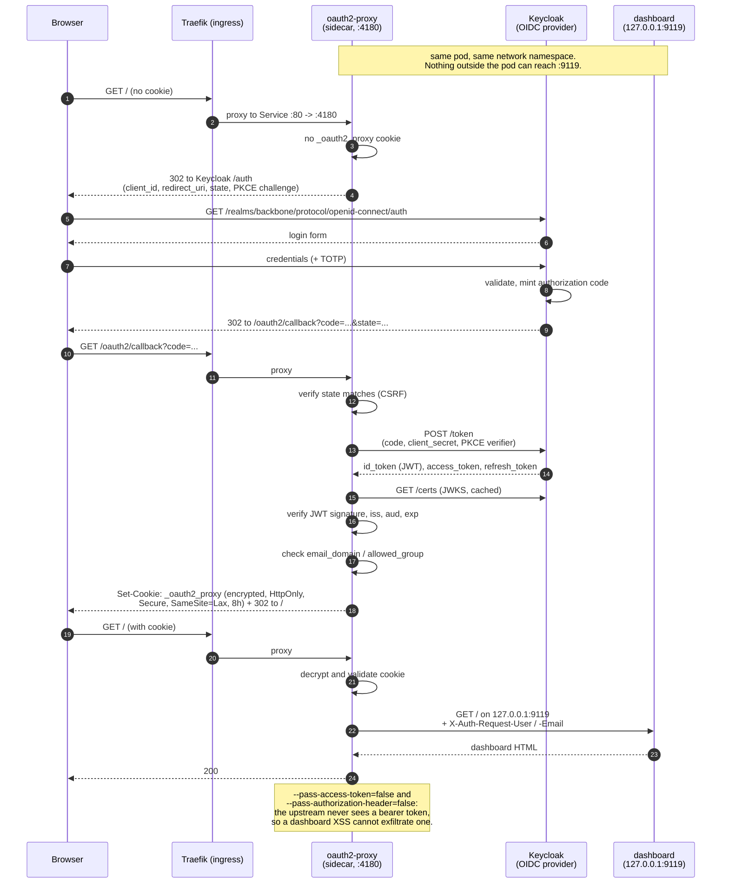

# 04 — SSO: Keycloak and oauth2-proxy

The brief asks for Keycloak (OIDC) plus oauth2-proxy in front of every HTTP surface, with an
actual sequence diagram.

The interesting part turned out to be **"every HTTP surface" is the wrong goal**, and §4
explains why.

---

## 1. Baseline

There is no SSO today. From [`00-CURRENT-STATE.md §5`](./00-CURRENT-STATE.md):

- `dashboard.oauth.client_id` — empty string.
- `dashboard.basic_auth.username` — empty string.
- The dashboard is protected by being bound to `127.0.0.1:9119` and reached over an SSH tunnel.
- Three webhook paths are Funnel-exposed to the internet, authenticated by a shared secret in
  the request.

So the dashboard's current security model is *network unreachability*, and the webhooks' is
*a bearer token by another name*.

## 2. Why Keycloak and not Cognito

`agent-fleet-on-eks` uses Cognito, because it targets an AWS account where Cognito is already
paid for and IAM-integrated. This is self-managed k3s on a VM with no cloud identity provider
attached. Using Cognito here would mean depending on an AWS account for a cluster that has no
other AWS dependency — coupling for nothing.

Keycloak is self-hosted, speaks standard OIDC, and costs a Postgres database and ~700 MB of
RAM. That RAM figure is why [`02-STATE-TRADEOFFS.md`](./02-STATE-TRADEOFFS.md) concludes the
target cluster cannot be the current 2 GiB droplet.

## 3. Topology

oauth2-proxy runs as a **sidecar in the gateway pod**, not as its own Deployment.

That is the load-bearing decision. The dashboard binds `127.0.0.1:9119` *inside the pod*.
Containers in a pod share a network namespace, so the oauth2-proxy sidecar can reach it and
**nothing else can** — not another pod, not a misconfigured Service, not a NetworkPolicy typo.

The alternative — dashboard on `0.0.0.0`, oauth2-proxy as a separate Deployment, a
NetworkPolicy restricting who may connect — gives the same protection *when the policy is
correct*. The sidecar arrangement does not depend on the policy being correct. Structural
beats declarative when the cost is the same.

The Helm template enforces it: setting `ingress.exposeDashboard=true` without `sso.enabled`
**fails the render** rather than warning.

```
$ helm template backbone charts/backbone --set ingress.exposeDashboard=true
Error: execution error at (backbone/templates/ingress.yaml:3:4):
ingress.exposeDashboard requires sso.enabled. Routing the dashboard without
oauth2-proxy in front of it would publish an unauthenticated UI [...]
```

That is verified — [`VALIDATION.md`](../VALIDATION.md) row L21.

## 4. Why the webhooks stay out of the OIDC flow

The brief says "in front of every HTTP surface". Applying that literally would break the system.

The three Funnel-exposed paths are called by **Vapi** and **Photon** — machine callers, mid
phone-call or mid-message-delivery. They cannot complete an interactive OIDC authorization code
flow. There is no browser and no human.

The options were:

| | |
|---|---|
| Client credentials grant against Keycloak | Correct in principle. Requires Vapi and Photon to support fetching and refreshing an OAuth token for outbound webhooks. Neither does; they send a static secret in a header |
| mTLS | Same problem, plus certificate distribution to a SaaS provider |
| **Keep shared-secret auth, add a rate limit** | What is implemented |

So: **the dashboard goes behind Keycloak; the webhooks keep HMAC-style shared secrets and gain
a 20 rps rate limit.** The distinction is *human surfaces get SSO, machine surfaces get
credentials*, and pretending otherwise would have produced a design that could not work.

## 5. The single-user problem

The Keycloak realm has one human user in it.

`--email-domain=*` is the default in this chart when `sso.emailDomains` is empty, which means
*anyone the IdP will authenticate gets in*. With a realm containing one account and no
self-registration, that is equivalent to allowing that one account. It is also exactly the
setting that becomes a vulnerability the moment a second identity provider is federated in, or
registration is enabled.

Stated so it is a decision rather than a default nobody looked at. In any multi-user
deployment, set `sso.emailDomains` or `sso.allowedGroups`.

## 6. The flow



## 7. Cookie and token decisions

| Setting | Value | Why |
|---|---|---|
| `--cookie-secure` | true | The cookie is a session bearer; it must never cross plain HTTP |
| `--cookie-httponly` | true | Blocks JavaScript access, so an XSS in the dashboard cannot steal the session |
| `--cookie-samesite` | lax | `strict` breaks the OIDC redirect back from Keycloak. `lax` is the correct choice for a redirect-based flow, not a compromise |
| `--cookie-expire` | 8h | One working day. Shorter re-authenticates mid-session; longer widens the window on a stolen cookie |
| `--pass-access-token` | **false** | The dashboard has no need to call other APIs on the user's behalf. Passing it upstream means a dashboard compromise yields a live token |
| `--pass-authorization-header` | **false** | Same reasoning |
| `--set-xauthrequest` | true | Gives the upstream identity headers without giving it a credential |
| `--skip-provider-button` | true | One provider; the intermediate page is friction with no choice on it |
| `--redirect-url` | **set explicitly** | Left unset, oauth2-proxy *derives* the callback from the request host and forces `https` whenever `--cookie-secure=true`. Observed: it sent `https://127.0.0.1:4180/oauth2/callback` at an http listener, and Keycloak returned **400** because no registered URI matched. Set it and register the same string |

`sso.cookieSecure` exists as a value and **defaults to true**. It was added only so an
in-cluster verification could exercise the flow without terminating TLS — with it true and a
plain-http listener the callback fails at `CSRF cookie '_oauth2_proxy_csrf' was not found` → 403,
because a `Secure` cookie is never sent over http. Both states are captured as evidence; the
refusal is worth as much as the login.

`OAUTH2_PROXY_COOKIE_SECRET` must be exactly 16, 24 or 32 bytes — it is the AES key for the
cookie. Generate with `openssl rand -base64 32 | head -c 32`. A wrong length fails at startup,
which is the good outcome; the bad one is a 32-character string that happens to be the right
length and was reused from somewhere else.

## 8. Verification status

Updated 2026-07-26 after the flow was run end to end on a live cluster. Raw output in
[`evidence/2026-07-25/sso-proof.txt`](../evidence/2026-07-25/sso-proof.txt).

**One caveat that does not go away:** Keycloak runs `start-dev`, which disables hostname
strictness and the HTTPS requirement. The OIDC protocol flow is identical — same authorization
code exchange, same JWKS verification — but this is not a production identity-provider
deployment, and the manifest says so inline rather than leaving it to be discovered.

| Claim | Status |
|---|---|
| The template refuses to expose the dashboard without SSO | **verified** — L21 |
| oauth2-proxy renders with correct args from values | **verified** — L22 |
| **A real login succeeds through Keycloak** | **verified** — K17. Full 5-step authorization-code flow; the dashboard returns 200 only with a session |
| The dashboard is unreachable without auth | **verified** — K18. Unauthenticated `GET /` → 302 to Keycloak, never the dashboard |
| `--cookie-secure=true` is genuinely enforcing | **verified** — K19. The same flow is *refused* over plain http: `CSRF cookie '_oauth2_proxy_csrf' was not found` → 403 |
| The upstream receives `X-Auth-Request-User` | **not verified** — `--set-xauthrequest=true` is set; the header reaching the dashboard was not asserted |
| Cookie expiry behaves as configured | **not verified** — would need an 8-hour observation |
| Keycloak survives a restart with its Postgres | **not verified** |
